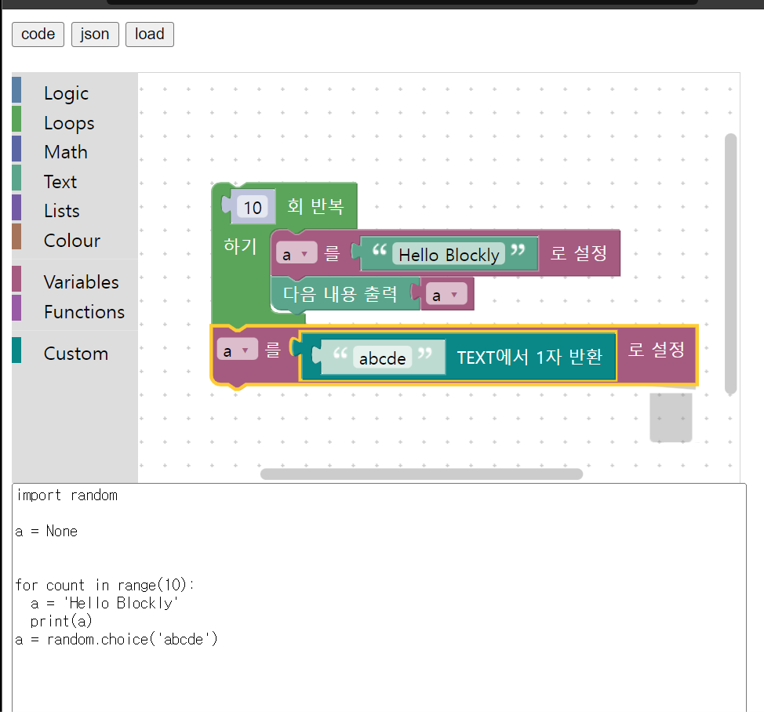

# Blockly Sample Code using Node.js
This repo contains sample code for using Blockly in a Node.js environment.

## Included Files
The following files are included in this repository:

- main.js
- index.html
- index.js
- static folder (contains blockly_compressed.js, python_compressed.js, blocks_compressed.js, ko.js, pythonblocks.js, and socket.io.min.js)

## main.js
This file sets up the Express server and creates a socket connection using socket.io. It also serves the index.html file when the root URL is accessed.

## index.html
This file contains the HTML for the user interface. It includes the necessary Blockly and socket.io JavaScript files, as well as buttons for generating code, generating JSON, and loading saved code.

## index.js
This file uses the Blockly.inject method to create the Blockly workspace, and sets up event listeners for the buttons in the user interface. The generated code is emitted through the socket connection to the server.

## Usage
To run this code, you will need to have Node.js and npm installed. Clone the repository and navigate to the directory in the terminal, then run the following commands:

node main.js
```
The user interface can be accessed at `http://localhost:3000`.\
```


